# Walk Back Home

> **What if your diary was not something you read, but somewhere you could return to?**

**Walk Back Home** is a personal memory RPG about walking through a life that has already happened.

Every diary entry can become a place.

A university corridor in the morning.<br>
A roadside stall.<br>
A room you spent an ordinary afternoon in.<br>
A bus ride. A meal. A stupid joke. A walk home.

None of these moments had to know they would become memories.

Most of them were just life while they were happening.

> **那时候也没觉得有什么。后来不知道为什么，就是还记得。**<br>
> *It didn't feel like anything special then. Somehow, you still remember it.*

And here, remembering means being able to walk back in.

---

## ▶ Play the live demo

<p align="center">
  <a href="https://ms-walk-back-home.vercel.app"><strong>Open Walk Back Home in your browser →</strong></a>
</p>

<p align="center">
  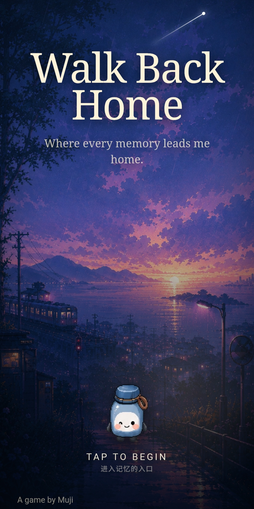
</p>

The browser demo is playable on desktop and mobile. Sound on is recommended.

### How the experience flows

```text
Open Walk Back Home
        ↓
Choose a way home
Story Route / Memory Forest / Muji Room
        ↓
Choose a chapter or a day
        ↓
Enter the memory as Muji
        ↓
Walk around and notice what is still there
objects · people · music · echoes · places
        ↓
Trigger the authored memory
        ↓
Watch the past happen as it happened
        ↓
Leave a reflection
        ↓
Return to the present
```

You can choose what Muji notices, where Muji lingers, and what reflection remains afterward. **You cannot rewrite what happened.**

<table>
  <tr>
    <td align="center">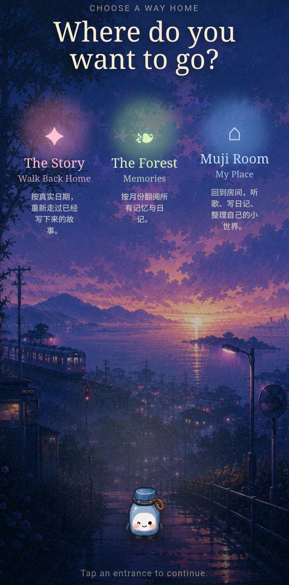<br><sub><b>Choose a way home</b></sub></td>
    <td align="center">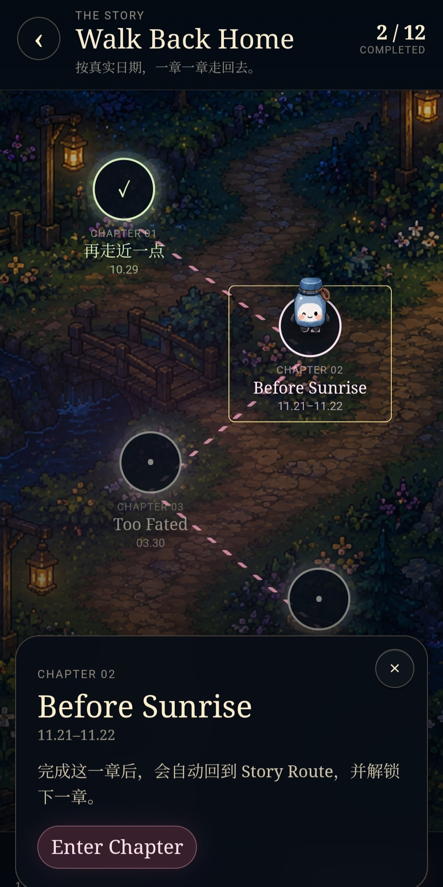<br><sub><b>Follow an authored story route</b></sub></td>
    <td align="center">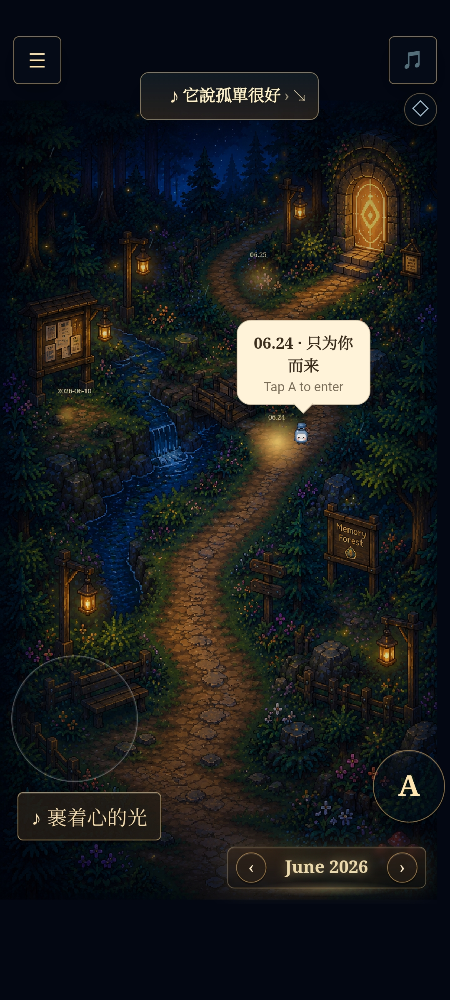<br><sub><b>Or wander through the Memory Forest</b></sub></td>
  </tr>
  <tr>
    <td align="center">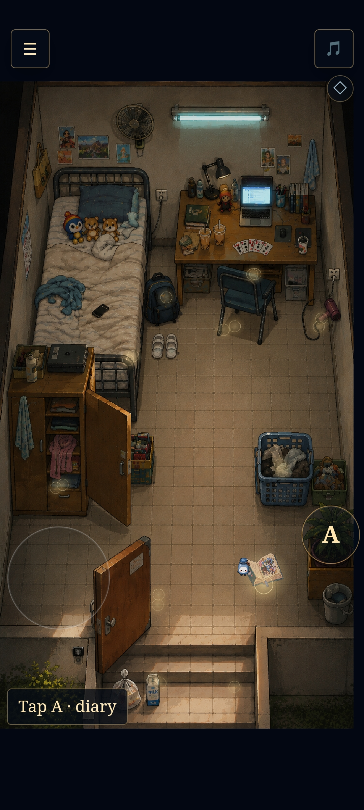<br><sub><b>Explore the place</b></sub></td>
    <td align="center">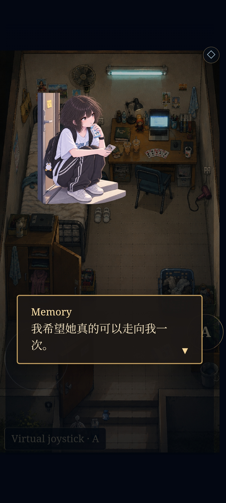<br><sub><b>Let the memory return</b></sub></td>
    <td align="center">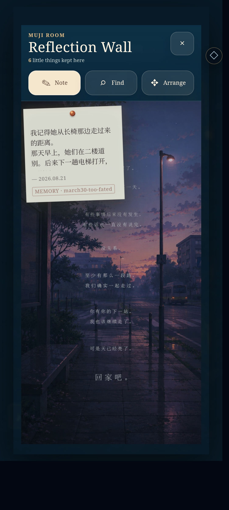<br><sub><b>Carry something home</b></sub></td>
  </tr>
</table>

<details>
<summary><strong>More from the present-tense side of Walk Back Home</strong></summary>

<br>

<table>
  <tr>
    <td align="center">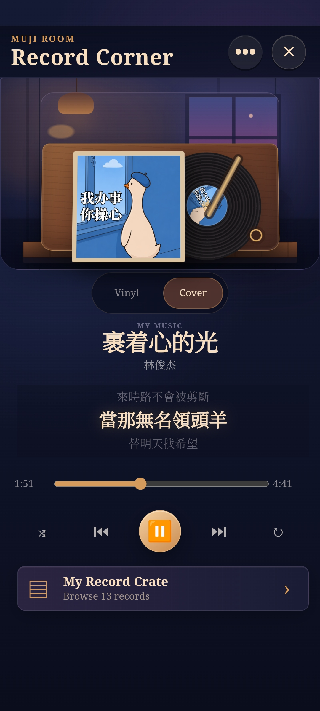<br><sub>Record Corner</sub></td>
    <td align="center">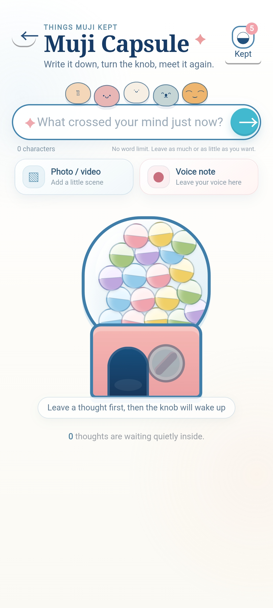<br><sub>Muji Capsule</sub></td>
    <td align="center">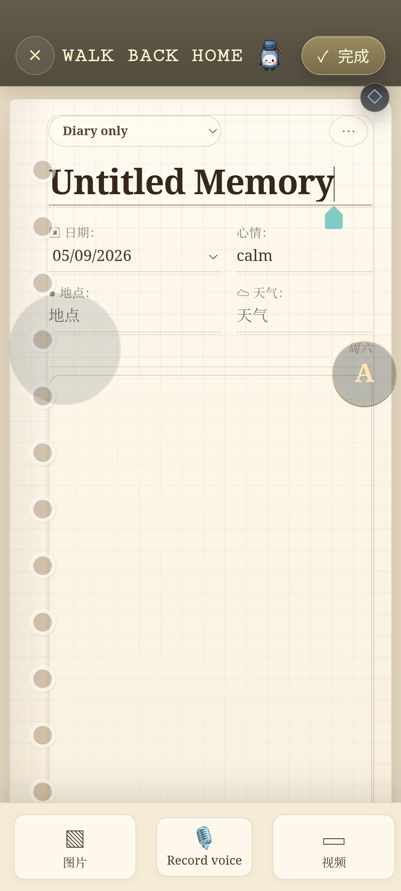<br><sub>Journal editor</sub></td>
  </tr>
  <tr>
    <td align="center">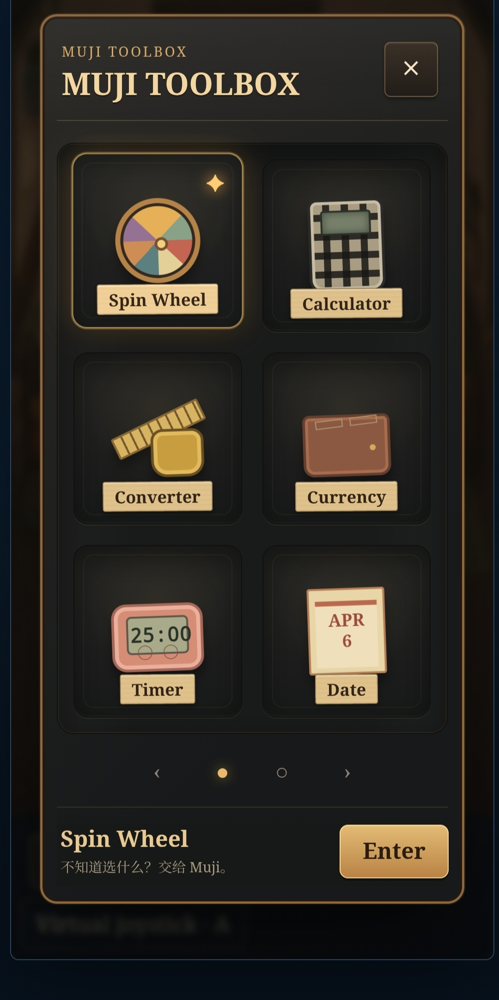<br><sub>Muji Toolbox</sub></td>
    <td align="center">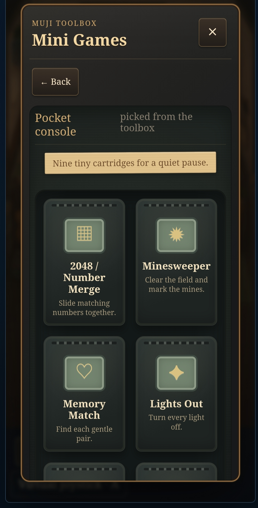<br><sub>Mini Games</sub></td>
    <td align="center">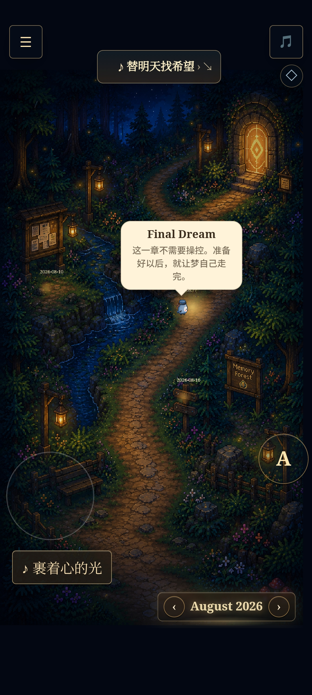<br><sub>Final Dream</sub></td>
  </tr>
</table>

</details>

---

## 🐾 You don't play as yourself

You play as **Muji** — a small companion carrying the memories you left behind.

Muji walks through places created from past diary entries, finding traces of people, conversations, objects, weather, music, and moments that once existed there.

Sometimes nothing happens at first.

Then Muji reaches a bench.

A doorway.

An old object in the room.

And for a little while, the past comes back.

People appear where they once stood.<br>
A conversation happens again.<br>
Someone laughs. Someone walks away.<br>
Something completely ordinary happens exactly as it did before.

Then the memory becomes quiet again.

Muji keeps walking.

---

## The past cannot be changed

Walk Back Home is not a game about fixing your past.

There is no choice where you stop someone from leaving.

No dialogue option lets you say the perfect thing you did not say.

No route turns an uncertain relationship into a different history.

**What happened, happened.**

The player's choices belong to the present:

> What does Muji notice?<br>
> What does Muji linger on?<br>
> What does this memory mean now?

Different choices may change the reflection that remains after a memory.

They never rewrite the memory itself.

> **Interpretation may change. Memory does not.**

---

## ☁️ Ordinary days are allowed to matter

Walk Back Home is interested in small things.

A half-finished meal.

Rain on the road.

A chair somebody used to sit on.

A song that happened to be playing.

A joke that was funny for approximately seven seconds.

A room that looked completely normal until one day you realized you would never see it in quite the same way again.

Not every memory needs to become a tragedy.

Not every memory is secretly a romance.

And please, not every Tuesday needs to become a life lesson.

Some things mattered for absolutely unimpressive reasons.

**You were there. Someone else was there. Something happened. You remember it.**

Sometimes that is enough.

---

## 🌲 A life becomes a world

Diary entries do not remain only as pages in a timeline.

They gradually become an explorable memory world.

Past days can become playable chapters.

Places become environments.<br>
Objects become memory triggers.<br>
Conversations return.<br>
Smaller details survive as echoes.

Muji can walk through these spaces, approach meaningful objects, trigger reenactments, listen to conversations, discover smaller traces, and eventually leave with a reflection.

The world is not trying to determine the one correct meaning of a memory.

It remembers what happened.

**You decide what you carry home.**

---

## 🌲 The Memory Forest

Memories are not isolated save files.

Together, they form a growing map of a life.

Some days become full playable chapters.

Some survive only as a small interaction, an object, a sentence, a song, or a place you can stand in for a while.

New memories slowly extend the world.

The result should feel less like opening an archive and more like wandering through somewhere strangely familiar.

You know these places.

You were there.

Just not like this.

---

## 🏠 Between memories

Walk Back Home is not only about entering the past.

There is also somewhere to return to.

### 📖 Journal

The Journal keeps the original days behind the playable memories.

Before a memory became a scene, it was simply something that happened and was written down.

### 🎵 Records

Some memories come with music whether you asked them to or not.

Records keeps songs connected to the life around them instead of turning them into detached background audio.

### 🏠 Muji Room

Muji has somewhere to exist between journeys.

A small present-tense room where the game is allowed to continue even when nobody is replaying the past.

### 🪞 Reflection Wall

Not everything needs to become a conclusion.

Some thoughts can just remain there.

The Reflection Wall keeps the things that followed Muji home from a memory.

### 🌙 Living Window

Even while the player is looking backward, the real world keeps moving outside.

Time changes.

Weather changes.

It might rain later.

The moon is doing moon things.

The Living Window keeps Muji's room connected to that present.

### 🎰 Capsule Machine

Sometimes the present needs a little randomness.

The Capsule Machine turns small prompts, choices, and curiosities into something you can physically draw from the world. Some capsules are opened and forgotten. Some are kept.

Not every interaction needs to become a memory chapter. Some can simply become part of living with Muji now.

### 🧰 Muji Toolbox

And sometimes a tool can just be a tool.

PDFs. Media. A spin wheel. Small local utilities. Tiny things that are useful, playful, or both.

**Not every part of life needs to become lore.**

Thank god.

---

## Why Walk Back Home exists

Most digital memories are stored as things to retrieve.

Photos live in galleries.

Messages live in chat histories.

Songs live in playlists.

Diary entries live in chronological lists.

They preserve information very well.

But remembering rarely feels like opening a file.

You remember the weather.

Where somebody was standing.

What was on the table.

A sentence you are no longer completely sure was said exactly that way.

The distance between two people.

Something tiny that should have disappeared with the rest of the day, but didn't.

Walk Back Home is an experiment in giving those memories space again.

Not to preserve life perfectly.

Not to explain it.

Not to use AI to confidently tell you what your own past meant. 🤡

Just to make somewhere you can walk back to.

---

## Memory is allowed to be incomplete

Walk Back Home does not treat memory as a puzzle with one correct answer.

Some details remain sharp.

Some become vague.

Some disappear completely.

People's intentions are not rewritten simply because the player wants an answer.

If a memory never explained itself in real life, the game does not need to solve it either.

The past can return without becoming clearer.

Sometimes that is the point.

> **The player does not rewrite the past.**<br>
> **The player learns how they are carrying it now.**

---

## 🇲🇾 Built from ordinary Malaysian life

Walk Back Home is grounded in the places the memories actually came from.

University corridors.

Roadside stalls.

Family homes.

Kopitiams.

Tiled floors.

Tropical afternoons.

Old cars.

Ceiling fans.

Rain that appears out of nowhere five minutes after the sky looked completely fine.

The emotional rhythm can be quiet and nostalgic.

The world itself should still feel like home.

Walk Back Home is not interested in sanding away where these memories came from just to make them look like somebody else's nostalgia.

---

## 🎮 What it actually is

At its core, Walk Back Home turns diary material into **playable memory chapters**.

A chapter may contain:

- an explorable environment
- characters from that particular memory
- environmental memory triggers
- dialogue and reenactments
- smaller echoes
- objects that mattered for reasons nobody else would understand
- reflection choices
- a return to the present

The goal is not to turn every diary entry into a visual novel.

The goal is to make the memory feel like a place.

A place Muji can enter.

A place that briefly remembers what happened there.

And then a place Muji eventually has to leave.

---

# 🛠 Development

If you came here for the feelings, you can stop before this part.

If you came here because the feelings somehow need TypeScript, welcome. 😭

Walk Back Home is developed as a browser-based TypeScript game and packaged for Android with Capacitor.

The canonical application lives in:

```text
apps/html-prototype
```

The current application includes playable authored memory chapters, landscape and portrait scene layouts, Journal, Records, Muji Room, Reflection Wall, Living Window, Muji Toolbox, optional private Supabase sync, and internal scene-authoring/debug tools.

---

## Repository

```text
apps/html-prototype/   Canonical Walk Back Home application
packages/shared/       Active shared schemas and tested contracts
android/               Capacitor Android project
docs/                  Design and implementation history
supabase/              Repository-level Supabase configuration
```

<details>
<summary><strong>Run Walk Back Home locally</strong></summary>

Use the Node version defined by `.nvmrc`.

```bash
npm install
npm run dev
```

</details>

<details>
<summary><strong>Verification</strong></summary>

The repository-level verification command checks authored expectations, TypeScript, tests, production build output, and whitespace errors:

```bash
npm run verify
```

You can also run the individual steps:

```bash
npm run typecheck
npm test
npm run build
```

The production HTML build is generated into:

```text
apps/html-prototype/dist
```

Build output is regenerated from the canonical runtime sources so removed artifacts do not silently survive in `dist`.

</details>

<details>
<summary><strong>Android build</strong></summary>

The Android project uses Capacitor with application ID:

```text
com.meishuet16.walkbackhome
```

Sync the latest web build and verify the required offline assets:

```bash
npm run android:sync
npm run android:assets
```

Then build the Android debug APK from `android/`:

```bash
./gradlew :app:assembleDebug
```

On Windows PowerShell:

```powershell
.\gradlew.bat :app:assembleDebug
```

The debug APK is generated at:

```text
android/app/build/outputs/apk/debug/app-debug.apk
```

The Android package bundles its runtime web assets locally, so the current app can launch and load its authored content without fetching the game itself from Vercel.

</details>

<details>
<summary><strong>Deployment & private data</strong></summary>

Vercel should use `apps/html-prototype` as the project root. The checked-in configuration uses `npm run build` and serves the static output from `dist`.

Local/fixture mode is the default, and no paid API or service is required for local development. Private specifications under `.private-spec/`, real diary entries, uploads, generated memory graphs, embeddings, scene caches, private media, and logs containing personal content are runtime data and must not be committed.

Optional private sync uses Supabase only when the explicit auth provider and Supabase environment variables are configured. It syncs private JSON data; imported Records audio and covers remain on the local device. Never place service-role or admin secrets in the frontend.

</details>

---

## 🌱 Status

### v0.1 — current milestone

The first complete Walk Back Home milestone is now playable across its main browser and Android paths.

The core systems are implemented.<br>
Authored memory chapters are playable.<br>
The Memory Forest and present-tense spaces are connected.<br>
The Android package can bundle and run the current authored experience offline.<br>
Build, CI, deployment, and Android packaging have all been validated for this milestone.

This does **not** mean the memory world is finished forever.

There are still more days than there are chapters, and future memories can continue extending the world.

But v0.1 no longer represents an unfinished prototype waiting to become real.

It is a complete first version of the idea:

> **A diary you can walk back into.**

**For now, Muji keeps walking.**
